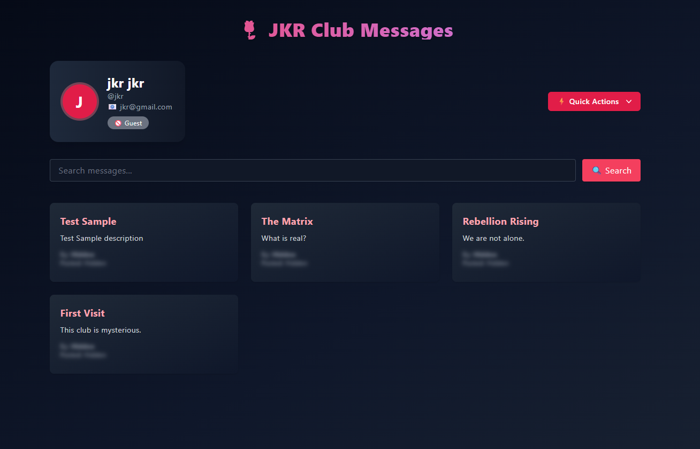
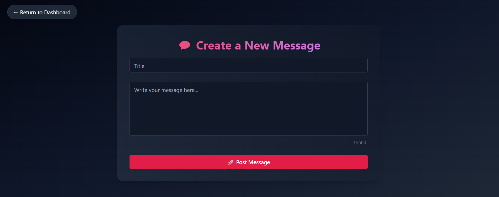
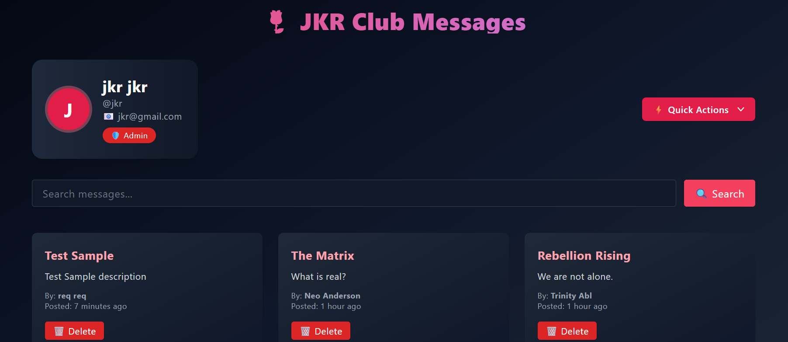

#  JKR Club - Members-Only Message Board

**JKR Club** is an exclusive, clubhouse where users can anonymously post messages visible to the public — but only members can see the true author and timestamp. Admins hold ultimate power, including the ability to delete messages.

>  Built with Node.js, Express, PostgreSQL, and Passport.js

---

##  Features

 **Authentication & Roles**
- Sign up with validation and secure password hashing (bcrypt)
- Login/logout flow via Passport.js
- Role-based access: Guest, Member, Admin

 **Messaging System**
- Post new messages (members only)
- View all public messages on the home page
- Only members/admins can see authors and timestamps

 **Search Functionality**
- Full-text search over message content, title, and authors
- Search restricted to members only

 **Membership System**
- Enter a secret passcode to join the club
- Separate flow for becoming an Admin

 **Admin Powers**
- Admins can delete any message
- "Delete" buttons are visible only to admins

---

##  Tech Stack

| Tech             | Purpose                           |
|------------------|-----------------------------------|
| Node.js + Express| Server and routing                |
| PostgreSQL       | Database                          |
| Passport.js      | Authentication                    |
| bcrypt.js        | Password hashing                  |
| EJS              | Templating engine                 |
| connect-flash    | Flash messaging                   |
| connect-pg-simple| PostgreSQL session storage        |
| express-validator| Sanitizing and validating forms   |
---

##  Screenshots

###  Sign-Up Form

###  Home Page

###  Dashboard

###  Create Message

###  Admin Passcode Form

###  Admin Deleting Message

